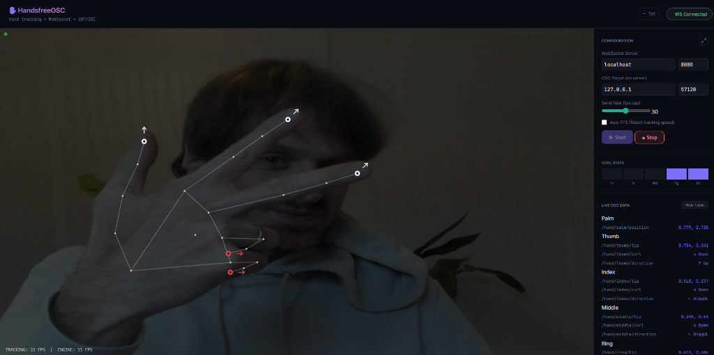
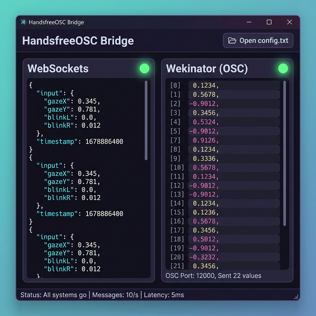

# HandsfreeOSC

A web-based creative tool that visualizes hand tracking data in real-time using **Handsfree.js** and **p5.js**, and bridges that data out via **OSC** to other creative coding environments (TouchDesigner, Resolume, puredata) and Machine Learning tools like **Wekinator**.




## Features

- **Real-time Dual Hand Tracking**: Tracks up to 2 hands using MediaPipe (via HandsfreeJS) at 30+ FPS.
- **Detailed Telemetry**: Computes (X,Y) coordinates for palm and all 5 fingertips.
- **Fingerpose Integration**: Automatically calculates Finger Curl (Open, Half, Closed) and Direction Angles (Up, Down, Diagonal, etc.).
- **Futuristic p5.js Visuals**: Clean, cyberpunk-inspired visualizer overlaying a dark-filtered camera feed.
- **Toggle UI Mode**: Hide all side panels and the header with a single click or by pressing **[H]** for a data-only fullscreen experience.
- **Hand Smoothing (Lerp)**: Built-in jitter reduction for smoother mapping in creative apps.
- **Variable Resolution**: Choose between Performance (480p), HD (720p), and Full HD (1080p) tracking.
- **Zero-Lag Architecture**: Uses WebSockets to pipe JSON directly out of the browser into local backend bridges.
- **Auto FPS Sync**: Matches the broadcast rate perfectly to your webcam's capabilities to save CPU.
- **Built-in Desktop App**: Python bridge with a modern `pywebview` interface.

## Acknowledgments & Credits

This project is built upon the wonderful work of the open-source community:
- **[Handsfree.js](https://handsfree.js.org/)**: This project is named in honor of this library. Massive thanks to **Oz Ramos** ([@midibloks](https://github.com/midibloks)) for creating such an accessible tool for hands-free interaction and for the inspiring [gesture capture examples](https://handsfreejs.netlify.app/gesture/).
- **[p5.js](https://p5js.org/)**: For the creative coding power behind the visualizer.
- **[Fingerpose](https://github.com/andypotato/fingerpose)**: For the baseline gesture estimation logic.

## Installation

You need Node.js installed on your machine.
Clone or download this repository, then run:

```bash
npm install
```

## Usage

This project contains the **Front-End Web Application** and two different **Backend Bridges**, depending on where you want to send your data.

### 1. Launch the Desktop App (Electron) - Recommended
This wraps the web interface into a standalone desktop window.

```bash
npm run electron
```

### 3. Controls & Shortcuts
- **[Start / Stop]**: Toggle the hand tracking engine.
- **[Toggle UI] / [H]**: Hide/Show side panels for a clean view.
- **[Smoothing Checkbox]**: Enable Lerp filter to reduce finger jitter.
- **[Resolution Dropdown]**: Set the camera capture quality. *Note: Changing resolution restarts the tracking.*
- **[Fullscreen Icon]**: Enter browser fullscreen mode.

### 4. Alternative: Run in Browser
If you prefer the browser, serve the directory:
```bash
npx serve
```
Open `http://localhost:3000` in your browser.

### 2. Choose your Bridge

The web app sends data via WebSockets (default `ws://localhost:8080`). You must run **one** of the following backend scripts to catch that data and convert it to UDP OSC messages.

#### Option A: Standard OSC Bridge (Node.js)
Ideal for standard creative coding software (TouchDesigner, SuperCollider, etc.) that accepts deeply nested OSC addresses.
- **Port:** `57120` (configurable in UI)
- **Format:** Sends 16 distinct addresses per hand (e.g., `/hand/index/tip 0.5 0.5`, `/hand/thumb/curl 1`)

**Run it:**
```bash
node server.js
```

#### Option B: Wekinator Bridge (Python)
Wekinator expects a single flat list of floats per frame (not separate addresses). This bridge catches the JSON and flattens it into an array of **22 floats** for ML training.

**Wekinator Setup:**
- **Inputs:** `22`
- **Port:** `6448`
- **OSC Message:** `/wek/inputs`

**Data Order (22 values):**
`[palm.x, palm.y, thumb.x, thumb.y, thumb.curl, thumb.dir, index.x, index.y, index.curl, index.dir, middle..., ring..., pinky...]`

**Automated Launcher (Windows):**
Simply double-click the **`run_bridge.bat`** file inside the `wekinator-bridge` folder. 
1. The script will automatically create a Python Virtual Environment (`venv`) if it doesn't exist.
2. It will install all necessary dependencies (`websockets`, `python-osc`, `pywebview`).
3. It will launch the premium Desktop App interface.

**Manual Setup:**
```bash
cd wekinator-bridge
python -m venv venv
.\venv\Scripts\Activate.ps1
pip install -r requirements.txt
python main.py
```

*(You can edit `wekinator-bridge/config.txt` to change the destination ports/IPs without touching the code. You can even click the "Open config.txt" button directly in the App!)*

## Data Interpretation & Normalization

All raw tracking data is normalized before being sent through WebSockets/OSC to ensure compatibility with tools like **Wekinator**:

### 1. Spatial Positioning
- **Positions `(x, y)`**: Normalized to a `0.0` to `1.0` scale (where `0,0` is the top-left of the camera view, and `1,1` is the bottom-right). 

### 2. Gesture Logic (Based on Handsfree.js / Fingerpose)
The finger state calculations follow the logic established by the **Handsfree.js** [Gesture platform](https://handsfreejs.netlify.app/gesture/):

- **Finger Curl**: A discrete float representing flexion. This is calculated by measuring the internal angles between joint segments:
  - `0.0` (**Open**): Finger is extended.
  - `0.5` (**Half**): Finger is partially flexed.
  - `1.0` (**Closed**): Finger is fully curled toward the palm.
- **Thumb Curl (Hybrid Heuristic)**: Because the thumb is highly mobile, we use a hybrid approach combining internal angles with a distance check relative to the base of the pinky to ensure 100% reliable "Closed" state detection when the thumb is tucked in.

### 3. Directional Compass
- **Finger Direction**: A float from `0.0` to `7.0`. This represents a 360° compass divided into 8 sectors of 45° each.
- **Standard Fingers**: Calculated from the vector between the base of the finger and the tip.
- **Thumb (Distal Phalanx Fix)**: To account for the thumb's unique rigidity and range of motion, the direction is calculated specifically using the **Distal Phalanx** (vector from the IP joint to the Tip). This provides a Much more stable orientation for mapping.

**Compass Mapping:**
- `0.0`: ↑ Up | `1.0`: ↗ Diag-UR | `2.0`: → Right | `3.0`: ↘ Diag-DR
- `4.0`: ↓ Down | `5.0`: ↙ Diag-DL | `6.0`: ← Left | `7.0`: ↖ Diag-UL

## Architecture Details

- **Webapp (`index.html`, `style.css`)**: The interface.
- **Tracking Core (`app.js`)**: Manages Handsfree.js, normalises data, calculates custom Thumb heuristics, and handles the WebSocket connection.
- **Visuals (`sketch.js`)**: A `p5.js` instance that handles the camera capture overlay and drawing the tracking UI.
- **Bridges (`server.js` or `wekinator-bridge/main.py`)**: Responsible for protocol translation from TCP/WS JSON to UDP OSC.

## Roadmap / TODO

- [ ] Create an automated `.sh` launch script for **MacOS / Linux** environments.
- [ ] Implement **UI Persistence**: Save configuration settings (IPs, Ports, FPS) using `localStorage` so they persist after refreshing the browser.
- [ ] Add more complex gesture recognition presets.
- [ ] Include multi-hand for larger Wekinator models.

---
*Developed for interactive OSC explorations. [dev ref](https://github.com/carlesgutierrez/)*
